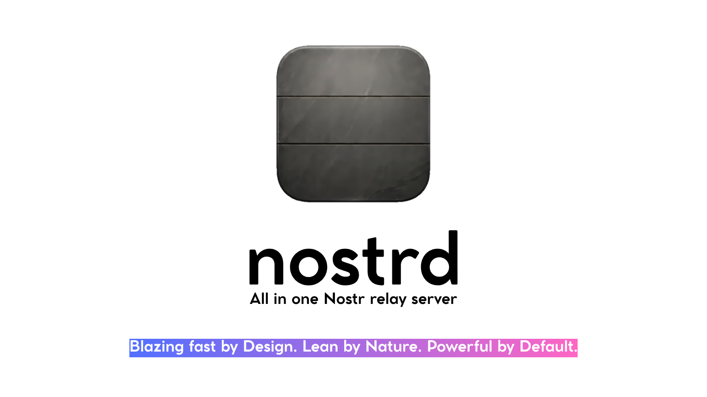

# nostrd

<p align="center">
  
</p>

<p align="center">
  <a href="https://github.com/iqbqioza/nostrd/actions/workflows/ci.yml"></a>
  <a href="https://github.com/iqbqioza/nostrd/actions/workflows/release.yml"></a>
</p>

> [!NOTE]
> This project is maintained by an individual in their spare time. If you'd like to show your support, please consider a tip via Lightning or Bitcoin.
>
> **Lightning address:** thank.you@iqbqioza.com
>
> **Bitcoin:** 13LUTf5tBXAv2TyEiKHpg9kVWtgiYz3ZYs
>
> **Bitcoin (SegWit):** bc1qttlc8m9gsh24xxqys26gaz2mtgfzw7s7770am6

> [!TIP]
> This project's relay is running live at **wss://relay.damustr.com**.

**All in one Nostr relay server written in Rust. Blazing fast by Design. Lean by Nature. Powerful by Default.**

nostrd is designed around two goals:

- **Never go down.** Overload protection, a dedicated reader thread, panic containment and strict resource bounds keep the relay serving even under sustained abuse, a stalled disk or a memory-constrained host.
- **Spec-complete.** All relay-side NIPs are implemented and verified against the official specifications (file-storage NIPs excluded by design, except Blossom via the dedicated file server).

## Table of contents

- [Documentation](#documentation)
- [Features](#features)
- [Install (pre-built binary)](#install-pre-built-binary)
- [Deployment](#deployment)
  - [Fly.io](docs/deploy/flyio.md)
  - [Digital Ocean](docs/deploy/digitalocean.md)
  - [AWS](docs/deploy/aws.md)
  - [Google Cloud](docs/deploy/gcp.md)
  - [Azure](docs/deploy/azure.md)
  - [Any VPS](docs/deploy/vps.md)
- [Requirements](#requirements)
- [Build](#build)
- [Quick start](#quick-start)
- [REST API](#rest-api)
- [Blossom file server (media hosting)](#blossom-file-server-media-hosting)
- [Commands](#commands)
- [Configuration](#configuration)
  - [Anti-abuse limits](#anti-abuse-limits)
- [NIP support](#nip-support)
- [Architecture notes](#architecture-notes)
- [Performance](#performance)
- [Repository layout](#repository-layout)
- [License](#license)

## Documentation

The detailed guides live in the [`docs/`](docs/) directory:

| Document | Contents |
| --- | --- |
| [Manual](docs/MANUAL.md) | Installation, configuration, operation, NIP support, NIP-29 groups, LiveKit, the Blossom file server, logs and statistics |
| [Configuration reference](docs/CONFIGURATION.md) | Every `nostrd.toml` option with its default and exact behavior, validation rules, SIGHUP reload, full example |
| [HTTP REST API reference](docs/API.md) | `/api/v1` endpoints, query parameters, pagination, errors, status codes |
| [Troubleshooting](docs/TROUBLESHOOTING.md) | Common errors and their step-by-step fixes |
| [Deployment guides](docs/deploy/README.md) | Deploy the pre-built release binary to Fly.io, Digital Ocean, AWS, GCP, Azure or any VPS |

## Features

- **All relay-side NIPs implemented** — see the [NIP support](#nip-support) table.
- **Blossom file server** — a media/blob store on its own hostname (like the API): uploads addressed by SHA-256, stored as `bucket/{npub1}/{file}` on local disk or in an S3-compatible bucket (AWS S3 / Cloudflare R2), with NIP-98-style kind-24242 auth, and an optional upload allowlist (`nostrd blossom allow/deny`, persisted in LMDB). Async storage I/O and an LMDB-persisted sha→owner mapping (no in-memory index) keep the relay's WebSocket path untouched.
- **REST API** — a read-only HTTP API at `/api/v1/...` for querying events by `npub1`, `nevent1` or `naddr1`, with its own dedicated database reader thread and concurrency limiter so REST traffic can never stall WebSocket subscribers.
- **LMDB persistence (via `heed`)** — durable, crash-safe storage; the memory map is a sparse virtual-address reservation opened at its configured ceiling, so it never needs a runtime resize (which would be unsafe with concurrent reader threads) and physical memory stays small.
- **Overload protection** — the database queue is bounded; when it fills up, new requests fail fast instead of accumulating in memory. Writes that reach the queue always wait for their true outcome, so a queued event can never silently commit after the relay reported a false failure (which would skip its side-effects).
- **Reader/writer thread split** — reads are served by dedicated threads that never take the LMDB write lock, so a stalled writer (slow disk, external lock holder) cannot take the relay down for readers. The REST API gets its own reader thread, isolated from WebSocket REQ/COUNT/NEG queries.
- **Per-IP connection cap** — a single host cannot consume the whole connection budget.
- **Optional WS idle timeout** — close connections that stay silent for a configured period (sending periodic PINGs so alive-but-idle subscribers keep their slot while dead peers are reaped), preventing a socket flood from exhausting the connection budget.
- **Panic-safe** — task panics are contained and logged, and connection accounting is released on every exit path.
- **Efficient hot paths** — single-pass event parsing, deduplicated live serialization, batched commits (one fsync per batch), merged multi-range scans with a per-scan work budget, and NIP-67 boundary handling.
- **Everything configurable** via `nostrd.toml` — no compile-time options.
- **Works behind TLS-terminating proxies** (nginx, Caddy, Cloudflare Tunnel): WebSocket upgrades are honored via `X-Forwarded-Proto`.

## Install (pre-built binary)

The GitHub Actions release workflow builds `nostrd` for **x86_64** and **aarch64** and attaches both binaries (plus checksums) to every release. The `install.sh` script downloads the right one, verifies its sha256 checksum and installs it into a directory on `PATH`.

The fastest way — **one-liner, no clone needed**:

```sh
curl -fsSL https://raw.githubusercontent.com/iqbqioza/nostrd/main/install.sh | sh
```

Or download and run it manually (useful to inspect the script first, or to pass options):

```sh
curl -fsSL -o install.sh https://raw.githubusercontent.com/iqbqioza/nostrd/main/install.sh
chmod +x install.sh
./install.sh                       # latest release, into ~/.local/bin (no sudo needed)

VERSION=v0.1.0-alpha-01 ./install.sh            # a specific release
INSTALL_DIR=/usr/local/bin sudo ./install.sh    # system-wide (requires sudo)
./install.sh --force                            # overwrite without asking
curl -fsSL https://raw.githubusercontent.com/iqbqioza/nostrd/main/install.sh | sh -s -- --force
```

The script picks the first of `~/.local/bin`, `~/bin` and `~/.cargo/bin` that is already on `PATH` (falling back to `~/.local/bin`, which it then tells you how to add to `PATH`). If `nostrd` already exists at the install location it asks for confirmation before overwriting. The install directory can be overridden with the `INSTALL_DIR` environment variable.

## Deployment

nostrd ships pre-built binaries for x86_64 and aarch64 (GitHub release assets) and a container image that downloads them — no compilation anywhere. Deployment guides are available for:

| Platform | Guide |
| --- | --- |
| Fly.io | [docs/deploy/flyio.md](docs/deploy/flyio.md) — four-step deploy with a persistent volume |
| Digital Ocean | [docs/deploy/digitalocean.md](docs/deploy/digitalocean.md) — Droplet or App Platform |
| AWS | [docs/deploy/aws.md](docs/deploy/aws.md) — EC2, Lightsail or ECS/Fargate |
| Google Cloud | [docs/deploy/gcp.md](docs/deploy/gcp.md) — Compute Engine or Cloud Run |
| Azure | [docs/deploy/azure.md](docs/deploy/azure.md) — VM or Container Apps |
| Any VPS | [docs/deploy/vps.md](docs/deploy/vps.md) — systemd service behind nginx/Caddy |

The VM guides share one pattern: `install.sh` → the `deploy/nostrd.toml` template → the `deploy/nostrd.service` systemd unit → open port 8080 → TLS proxy in front. Overview: [docs/deploy/README.md](docs/deploy/README.md).

### Registering the relay as a systemd service (VMs)

The repository ships a hardened unit at `deploy/nostrd.service` (it runs `nostrd start --foreground` and restarts the relay on failure):

1. **Fetch the config template and edit it** (no repository clone needed):

   ```sh
   sudo mkdir -p /etc/nostrd
   sudo curl -fsSL -o /etc/nostrd/nostrd.toml \
     https://raw.githubusercontent.com/iqbqioza/nostrd/main/deploy/nostrd.toml
   sudo nano /etc/nostrd/nostrd.toml        # set name, public_url, private_key
   ```

2. **Fetch the unit and start it**:

   ```sh
   sudo curl -fsSL -o /etc/systemd/system/nostrd.service \
     https://raw.githubusercontent.com/iqbqioza/nostrd/main/deploy/nostrd.service
   sudo systemctl daemon-reload
   sudo systemctl enable --now nostrd
   ```

3. **Check it**:

   ```sh
   sudo systemctl status nostrd             # active (running)
   curl http://localhost:8080/health        # {"status":"ok"}
   journalctl -u nostrd -f                  # logs
   ```

The unit restarts the relay automatically on crashes and on boot. `sudo systemctl restart nostrd` applies config changes.

## Requirements

- Linux / macOS / other Unix-like OS (daemonization uses the `daemonize` crate)
- Rust 1.85+ (edition 2024)
- A 64-bit system is recommended (LMDB maps can be huge on 32-bit systems)

## Build

```sh
cargo build --release
# the binary is at target/release/nostrd
```

## Quick start

```sh
# write a default nostrd.toml and exit
nostrd init

# start the relay as a daemon (add --foreground to run in the shell)
nostrd start

# check it is up
nostrd stats
```

Point your Nostr client at `ws://<host>:8080` (or `wss://<domain>` behind a TLS proxy).

## REST API

nostrd exposes a **read-only HTTP API** on the same port under `/api/v1`, served by a dedicated database reader thread with its own concurrency limiter, so heavy REST traffic can never stall WebSocket subscribers.

| Endpoint | Description |
| --- | --- |
| `GET /api/v1/{npub1...}/{kind}` | Events by author pubkey and kind (the `{kind}` path is mandatory for `npub1`) |
| `GET /api/v1/{nevent1...}` / `GET /api/v1/{note1...}` | A single event by its NIP-19 id |
| `GET /api/v1/{naddr1...}` | Addressable/replaceable events by NIP-19 address |

Query parameters: `limit`, `offset`, `since`, `until`, `sort`, `search`, `e`, `p`, `t`, `d`. Responses are `{ "events": [...], "count": N, "more": bool }`; `offset` + `more` paginate over the *visible* sequence (NIP-70 protected, NIP-59 gift wraps and NIP-29 private/hidden group content are withheld).

By default the API is served on every host; set `server.api_host` (e.g. `api_host = "api.example.com"`) to serve it only on that hostname and hide `/api/v1` from every other host.

**Full reference — endpoints, parameters, pagination, errors, status codes: [HTTP REST API reference](docs/API.md).**

## Blossom file server (media hosting)

nostrd doubles as a [Blossom](https://github.com/hzrd149/blossom) blob server on a dedicated hostname: clients upload files addressed by their SHA-256, and the relay serves them back — with `bucket/{npub1}/{file}` storage on local disk or in an S3-compatible bucket (AWS S3 / Cloudflare R2).

```toml
[blossom]
host = "media.example.com"          # this Host header serves only the Blossom routes
storage = "local"                   # "local" or "s3" (Cloudflare R2 is S3-compatible)
local_path = "./data/images"        # <local_path>/<npub1...>/<sha256>
# storage = "s3" + s3_endpoint / s3_region / s3_bucket / s3_access_key / s3_secret_key
restrict_uploads = false            # true = only allow-listed pubkeys may upload
```

| Endpoint | Description |
| --- | --- |
| `GET /` | Blossom server info (on the Blossom host) |
| `GET` / `HEAD` `/<sha256>[.ext]` | Fetch / probe a blob |
| `PUT /upload` | Upload a blob (kind-24242 auth) |
| `GET /list/<pubkey>` | Blobs uploaded by a pubkey |
| `DELETE /<sha256>` | Delete a blob (uploader only) |

The upload allowlist is managed in the relay database (LMDB), independent from the relay's own allow/deny lists:

```sh
nostrd blossom allow npub1...       # allow a pubkey to upload
nostrd blossom deny npub1...        # revoke a pubkey
nostrd blossom list
```

**Full guide: [Blossom chapter of the manual](docs/MANUAL.md#11-blossom-file-server-media-hosting).**

## Commands

| Command | Description |
| --- | --- |
| `nostrd init` | Write a default configuration file and exit |
| `nostrd genkey` | Generate a relay secret key (for NIP-29 group metadata and NIP-43 membership events) and write it into `relay.private_key` of the config file. Preserves the rest of the file; asks for confirmation (y/N) when a key is already set. Prints the relay pubkey (the NIP-11 `self`). |
| `nostrd start` | Start the relay as a daemon (`--foreground` to stay in the shell) |
| `nostrd stop` | Stop the running daemon |
| `nostrd restart` | Stop and start again (reloads `nostrd.toml`) |
| `nostrd stats` | Show live statistics of the running daemon |
| `nostrd check` | Validate `nostrd.toml` and exit |

All commands accept `--config <path>` (default `./nostrd.toml`).

Sending `SIGHUP` to the daemon reloads the configuration at runtime: most limits, server auth settings, the NIP toggles (including the NIP-40 toggle, applied live) and the REST API concurrency ceiling apply immediately. A few settings are captured at startup and require a full restart: `live_buffer`/`live_batch_size`/`live_batch_interval_ms`, `server.api_host`, `server.management_port`, `server.metrics_enabled`, `relay.private_key` (a reload warns that it is ignored), `relay.livekit_url`, `daemon.log_max_size_bytes`/`log_max_files`, the database request timeouts/queue caps, `purge_interval_secs`, `stats_interval_secs` and `max_indexed_words`. An invalid reloaded file is rejected (the old configuration stays in force). The access control lists are runtime-managed (NIP-86) and are **not** overwritten by a reload.

## Configuration

Every setting is optional — missing entries fall back to the defaults, and `nostrd.toml.example` documents every option with comments. The configuration has six sections:

| Section | Purpose |
| --- | --- |
| `[relay]` | Identity, URLs (incl. `public_url` for NIP-42/62/98), `private_key`, LiveKit, NIP toggles |
| `[server]` | Binding, `api_host` split, management API, authentication |
| `[limits]` | All limits and overload protections (connections, events, search, API bounds) |
| `[database]` | LMDB storage (paths, memory-map sizes, search index) |
| `[daemon]` | PID/log/stats files and log rotation |
| `[access]` | Initial access control lists (NIP-86 manages them at runtime) |

`nostrd check` (and startup) validate the file and warn about common misconfigurations — e.g. an empty `relay.public_url` with a wildcard/loopback bind (which would break NIP-42 AUTH, NIP-62 vanish and NIP-86 NIP-98 auth), a `require_pow` high enough to make mining infeasible, incomplete LiveKit settings, or the `require_auth` + `send_auth_challenge = false` lockout.

**Full reference — every key, its default and its exact behavior, validation rules, SIGHUP reload, full example: [Configuration reference](docs/CONFIGURATION.md).**

### Anti-abuse limits

In addition to the tunables above, a few hard bounds are fixed to keep the relay responsive under abuse:

- A single filter may carry at most **512 `ids` or `authors` entries**; larger filters are rejected (the per-candidate match is linear in these arrays, so unbounded arrays would allow quadratic work per REQ).
- Event ids in `ids` filters may be prefixes, but only full 32-byte ids and even-length prefixes are matched (odd-length/empty entries are ignored, consistently for historical and live delivery).
- Over-long index keys (a tag value, content word or `d` tag long enough to exceed LMDB's key-size limit) are skipped at indexing time rather than aborting the write batch; the event is still stored.

## NIP support

All relay-side NIPs are implemented; client-side NIPs are stored and served as plain events but are deliberately **not** advertised in the NIP-11 document (per the spec). File-storage NIPs (34 git, 94 file metadata, 95/96 HTTP file storage) are excluded by design — except Blossom, which is provided by the dedicated [Blossom file server](#features).

| NIP | Description |
| --- | --- |
| [01](https://github.com/nostr-protocol/nips/blob/master/01.md) | Basic protocol (EVENT/REQ/CLOSE, filters, replaceable/ephemeral/addressable events) |
| [09](https://github.com/nostr-protocol/nips/blob/master/09.md) | Event deletion |
| [11](https://github.com/nostr-protocol/nips/blob/master/11.md) | Relay information document |
| [13](https://github.com/nostr-protocol/nips/blob/master/13.md) | Proof of work |
| [26](https://github.com/nostr-protocol/nips/blob/master/26.md) | Delegated event signing |
| [28](https://github.com/nostr-protocol/nips/blob/master/28.md) | Public chat (channel messages are served via the `#e` index) |
| [29](https://github.com/nostr-protocol/nips/blob/master/29.md) | Relay-based groups (moderation events, relay-signed metadata, subgroups, invite codes, LiveKit rooms) |
| [33](https://github.com/nostr-protocol/nips/blob/master/33.md) | Parameterized replaceable events |
| [40](https://github.com/nostr-protocol/nips/blob/master/40.md) | Expiration timestamp |
| [42](https://github.com/nostr-protocol/nips/blob/master/42.md) | Client authentication (AUTH) |
| [43](https://github.com/nostr-protocol/nips/blob/master/43.md) | Relay access metadata and requests (roles, membership lists, join/leave) |
| [45](https://github.com/nostr-protocol/nips/blob/master/45.md) | Counting results (COUNT, with HyperLogLog registers) |
| [50](https://github.com/nostr-protocol/nips/blob/master/50.md) | Search capability (whole-word terms, relevance-ordered by IDF weights) |
| [59](https://github.com/nostr-protocol/nips/blob/master/59.md) | Gift wrap (recipient-only serving, NIP-09/62 linked deletion) |
| [62](https://github.com/nostr-protocol/nips/blob/master/62.md) | Request to vanish |
| [67](https://github.com/nostr-protocol/nips/blob/master/67.md) | EOSE completeness hint (`finish`/`more`) |
| [70](https://github.com/nostr-protocol/nips/blob/master/70.md) | Protected events |
| [77](https://github.com/nostr-protocol/nips/blob/master/77.md) | Negentropy syncing (NEG-OPEN/MSG/CLOSE) |
| [86](https://github.com/nostr-protocol/nips/blob/master/86.md) | Relay management API (JSON-RPC) |
| [98](https://github.com/nostr-protocol/nips/blob/master/98.md) | HTTP auth (kind 27235) |
| [Blossom](https://github.com/hzrd149/blossom) (BUD-01/02) | File server — SHA-256-addressed uploads (kind-24242 auth), served on the `[blossom]` hostname (see [above](#blossom-file-server-media-hosting)) |

## Architecture notes

- **Single database thread for writes**, with puts merged into batches that share one write transaction (one fsync per batch). Replies are sent only after a successful commit, so an `OK` implies durability.
- **Dedicated reader threads** serve queries/counts/lookups without ever taking the write lock. If a commit is blocked (stalled disk, external lock holder), reads keep working. The REST API runs on its own reader thread with its own bounded queue, so an `/api/v1` flood can neither queue up behind nor delay WebSocket REQ/COUNT/NEG queries.
- **Bounded queues everywhere** — the database request queue (fail-fast overload protection), the outgoing message queue (per-connection byte cap), the live fan-out channel and the negentropy item store are all capped. The REST API has its own concurrency limiter (`api_max_concurrent`) that fails fast with `503` when saturated.
- **The LMDB map is opened at its configured ceiling** and never resized at runtime: resizing would require that no read transactions are active, which cannot be guaranteed with concurrent reader threads. The reservation is a sparse virtual-address mapping, so physical memory and disk grow only with the data actually written.
- **Scan engine** — multi-range filters (`authors`, `kinds`, `#tag`) are walked with a merged newest-first iterator so a per-filter `limit` applies to the union of all ranges; NIP-67 boundary handling never splits a `created_at` tie across pages. A per-scan work budget bounds the candidates examined so a filter matching nothing cannot walk an entire index range.
- **Panic containment** — the database thread, the reader threads and every connection task are isolated; a fault in any of them is logged and does not take the relay down.
- **Per-IP connection accounting** — the number of active WebSocket connections per source IP is tracked and capped, so a socket flood from one host cannot evict legitimate clients.

## Performance

Measured on the release build (5 concurrent connections, fresh database, fsync per commit):

| Operation | Result |
| --- | --- |
| Event publish (signature verification + fsync commit) | ~1,100–1,400 events/s |
| Query (limit 100, tag filter) | 50 queries in ~1.4 s |
| Live notification delivery (publish → subscriber) | median ~6 ms, p95 ~12 ms |
| COUNT (NIP-45) | 50 counts in ~0.9 s |

Sustained-load stability test (10 connections × 30 s, ~20,000 published events):
zero database errors, zero panics, zero rejected events. The memory map is a
virtual address-space reservation: a freshly started relay uses only a few
tens of MB of physical memory regardless of `map_size`.

## Repository layout

```
src/
├── main.rs, cli.rs, config.rs   entry point, CLI, nostrd.toml
├── util.rs, error.rs, event.rs, filter.rs, stats.rs
├── db/                          LMDB storage
│   ├── mod.rs                   DbClient handle and request plumbing
│   ├── threads.rs               dedicated writer/reader/API-reader threads
│   ├── store.rs                 write path and index maintenance
│   ├── removal.rs               deletions, bans, vanish, expiry purge
│   └── scan.rs                  query engine (filters, merged walks, collectors)
├── relay/                       event acceptance and NIP-29/43 state
│   ├── mod.rs                   accept paths, live fan-out
│   ├── validate.rs              pre-acceptance checks (shared by both paths)
│   └── roles.rs                 NIP-43 role administration
├── server/                      HTTP/WebSocket front end
│   ├── mod.rs                   router, CORS, background tasks
│   ├── api.rs                   read-only REST API (/api/v1)
│   └── livekit.rs               NIP-29 LiveKit token endpoint
├── ws/                          connection handling
│   ├── mod.rs                   connection loop and live delivery
│   ├── handler.rs               protocol message handlers
│   └── negentropy.rs            NIP-77 NEG-OPEN/MSG/CLOSE
└── nips/                        per-NIP modules (some split further, e.g.
                                nip29/{mod,events,tests}, nip77/{mod,codec},
                                nip86/{mod,legacy})
```

## License

MIT
